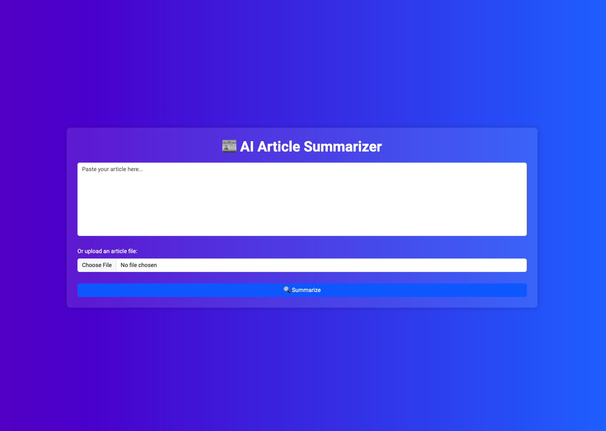

Article Summarizer web app built with Flask. It allows users to input or upload an article and has two summarization options: a NLP-based summarizer using NLTK and an AI-based summarizer using HuggingFace's transformers library. Users can either copy and paste or upload a file to get a summary. This application uses PyTorch or TensorFlow to run the AI model.

