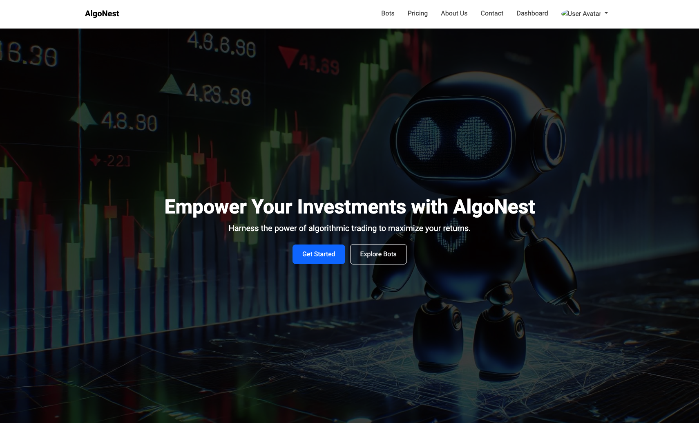
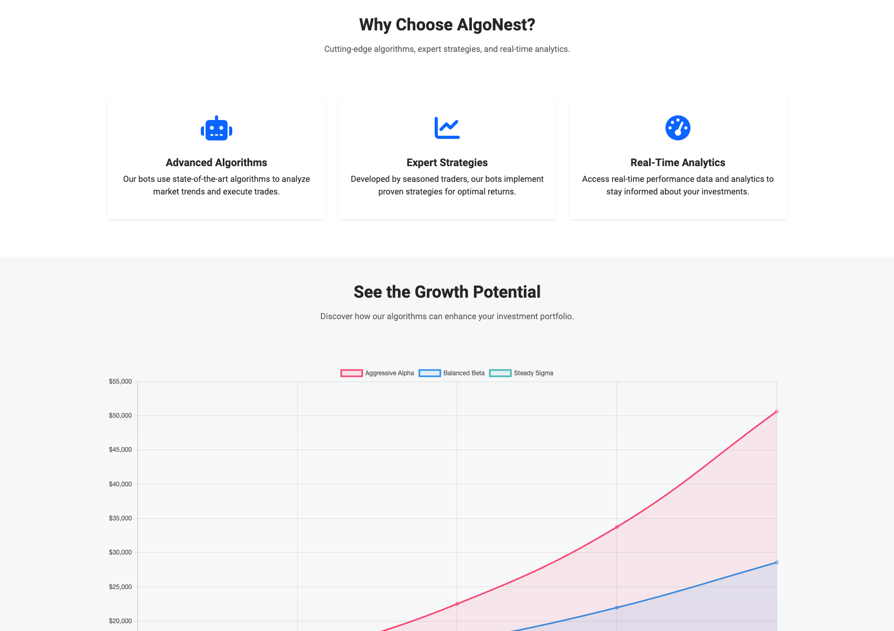
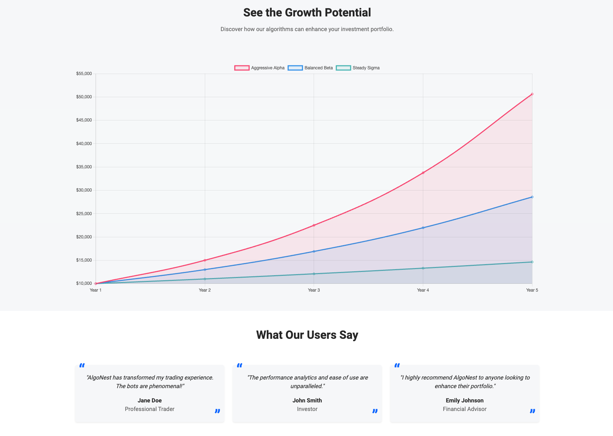
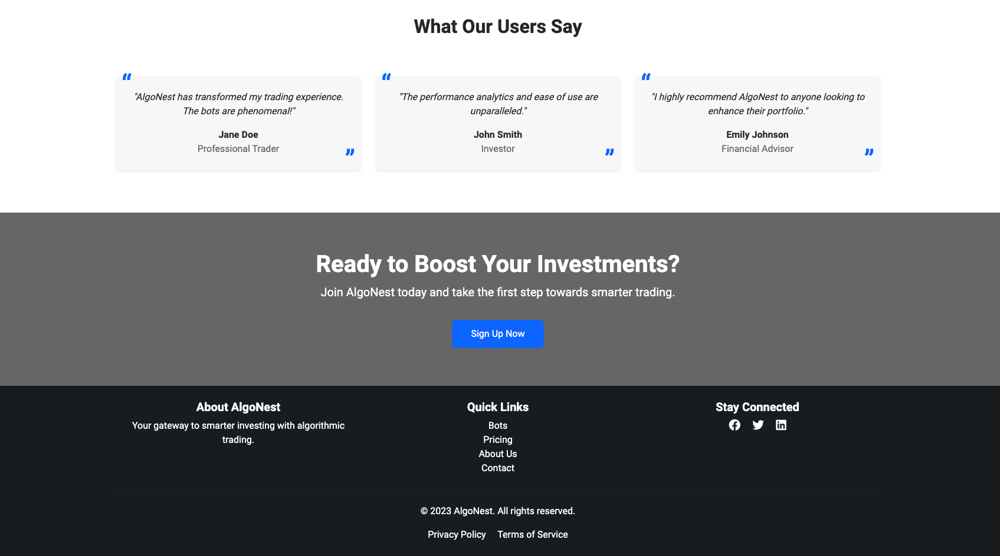
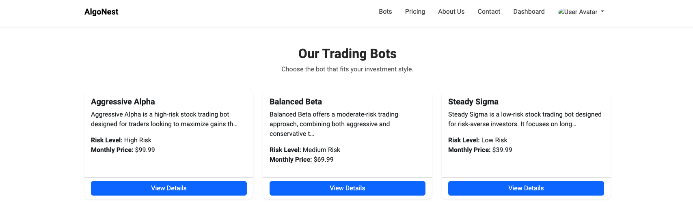
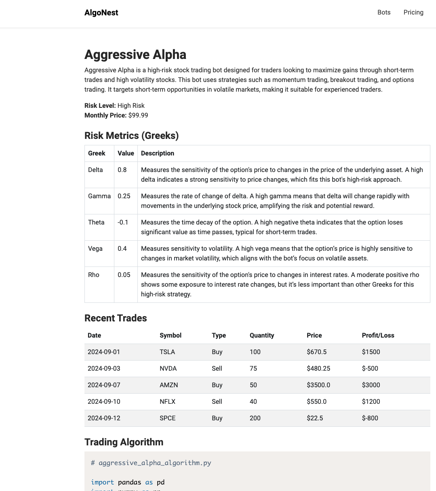
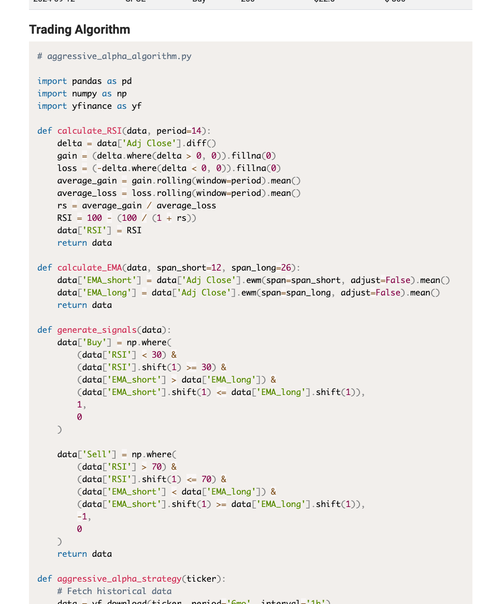

### **Application Overview:**

This application, **AlgoNest**, is a subscription-based platform that allows users to subscribe to and use various algorithmic trading bots. It provides a modern interface where users can view, subscribe to, and monitor the performance of trading bots with different risk profiles.

### **Technologies Used:**

1. **Django** (Python Framework):
   - Core framework used to build the backend.
   - Handles routing, views, and logic for user authentication, bot listing, and performance tracking.

2. **Django Authentication System**:
   - Utilized for user registration, login, logout, and profile management.

3. **SQLite**:
   - Default database used for storing user data, bot information, and other application-related data.

4. **HTML/CSS (Bootstrap 5)**:
   - Bootstrap 5 is used for front-end styling to ensure a modern and responsive design.
   - Custom CSS is used to fine-tune the aesthetic of the website.

5. **JavaScript**:
   - For rendering dynamic charts and interactive elements.
   - **Chart.js** is used to display performance data visually, allowing users to see bot performance over time.

6. **Prism.js**:
   - A syntax-highlighting library used for displaying algorithm code in a visually appealing way on the bot detail pages.

7. **Static Files (CSS, JS, Images)**:
   - Managed through Django’s `static` file system.
   - Includes custom stylesheets, JavaScript files, and images to enhance the website's appearance.

8. **User Dashboard**:
   - Provides users with an overview of their investments, including the amount invested, current value, and profit/loss.
   - Displays interactive graphs using **Chart.js** to track the performance of their bots over time.

9. **Subscription and Pricing Pages**:
   - Dedicated pages for users to explore subscription options for different bots and view pricing information.

10. **Algorithm Display**:
    - For each bot, the relevant Python algorithm is displayed on the bot detail page using **Prism.js** for syntax highlighting.
    - Users can explore how the algorithm works and understand the strategy behind the trading bot.

### **Key Features:**

1. **User Authentication**:
   - Registration and login functionality.
   - Authenticated users have access to personal dashboards and can subscribe to trading bots.

2. **Bot Listing**:
   - A dedicated page lists all available bots with detailed descriptions, monthly pricing, and risk levels (Low, Medium, High).
   - Each bot can be explored in more detail by clicking on its name.

3. **Bot Detail Pages**:
   - Users can view detailed information about each bot, including its risk metrics, recent trades, and historical performance.
   - Each bot’s trading algorithm is displayed for transparency.

4. **Dashboard**:
   - Provides users with an overview of their current investments, including performance data, total invested amounts, and profit/loss.
   - Interactive charts to help users track the performance of their investments.

5. **Pricing and Subscription**:
   - Users can view subscription pricing for each bot on the pricing page.
   - Users can sign up for an account to subscribe to bots and start using their services.

6. **Privacy Policy and Terms of Service**:
   - Legal documents are available for users to understand the terms of service and privacy policies associated with using the platform.

