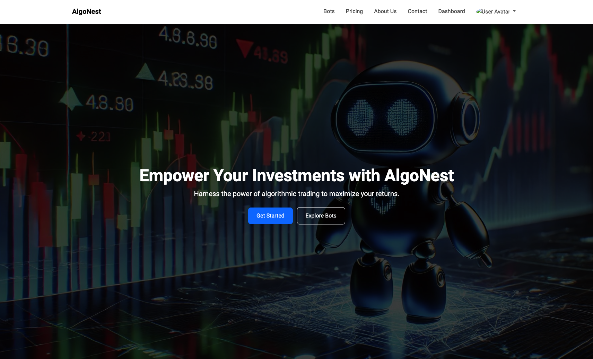
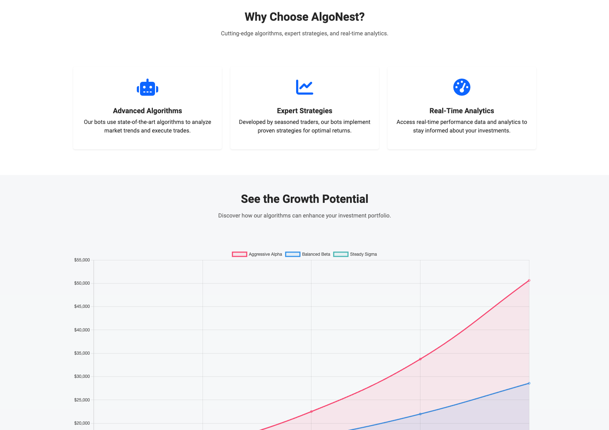
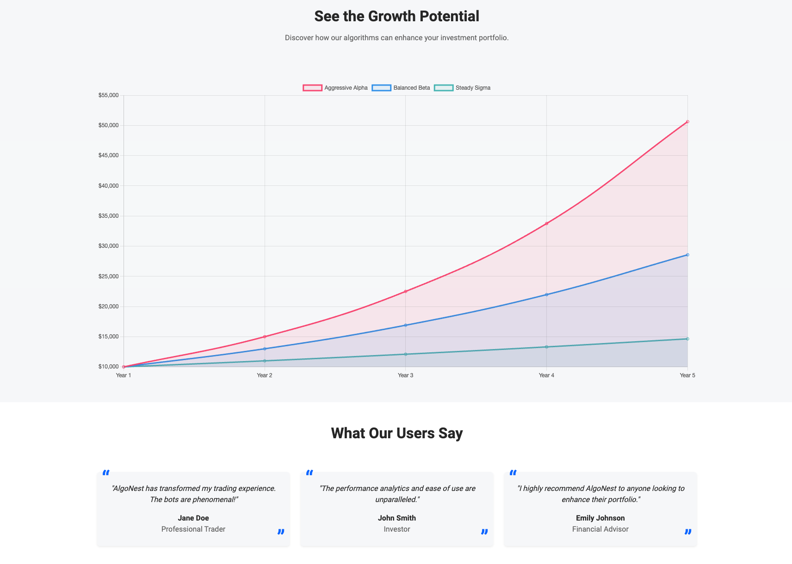
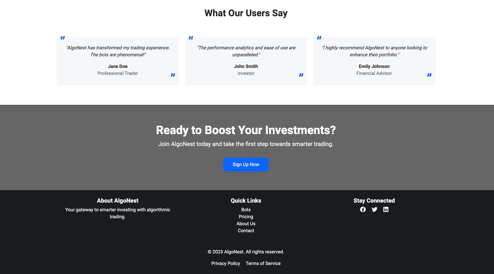
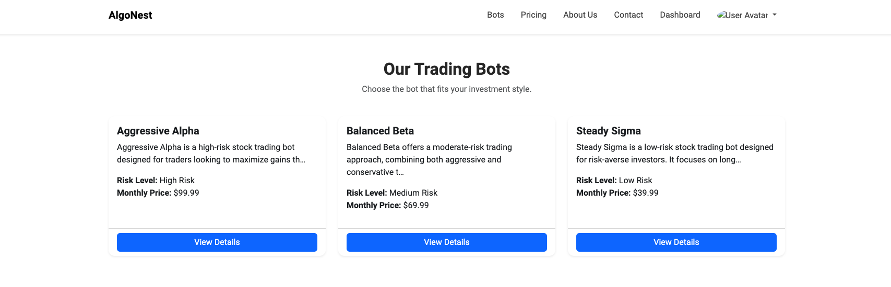
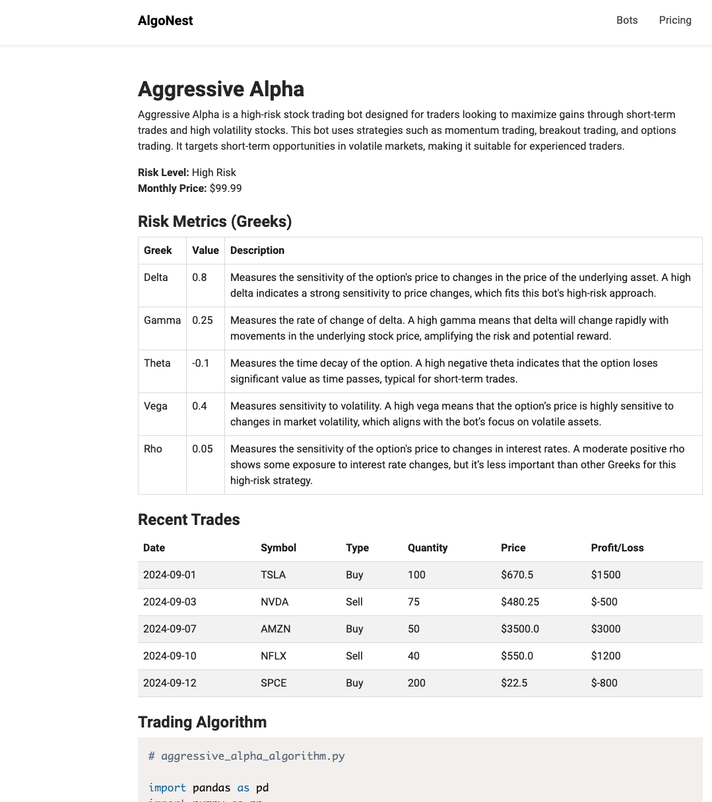
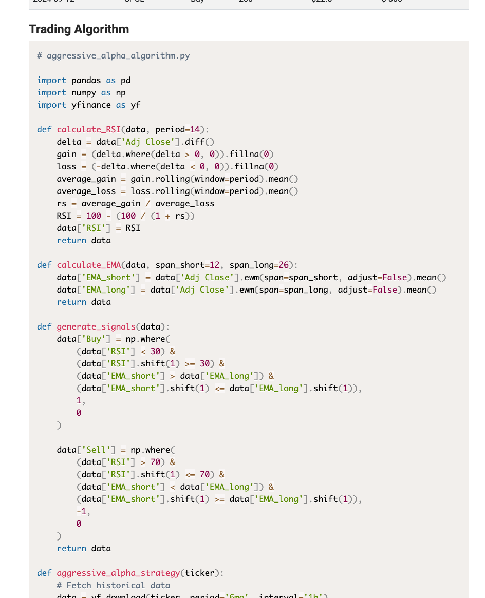

<div align="center">

# 🧠 Project Collection

### A curated portfolio of full-stack applications, systems engineering, data science, and mobile development projects

[]()
[]()
[]()

</div>

---

## Overview

This repository is a comprehensive collection of software projects spanning **machine learning & statistical modeling**, **full-stack web development**, **systems programming**, **iOS mobile development**, **data visualization**, and **desktop GUI applications**. Projects range from large-scale prediction engines with 80,000+ lines of code to focused algorithm implementations — each demonstrating different facets of software engineering.

> **Projects are ordered by technical complexity and scope — from most advanced to foundational.**

---

## Table of Contents

| # | Project | Domain | Stack |
|:-:|---------|--------|-------|
| 1 | [**PropAI**](#1--propai--nba-props-predictor) | ML / Sports Analytics | Python, Flask, SQLite, Statistical Modeling |
| 2 | [**NBA Dashboard**](#2--nba-three-point-revolution-dashboard) | Data Visualization | D3.js, JavaScript, GitHub Pages |
| 3 | [**Job Application Dashboard**](#3--job-application-dashboard) | Desktop Application | Python, PyQt6, SQLite, Matplotlib |
| 4 | [**Database Management System**](#4--database-management-system) | Systems Engineering | Python, pyparsing, B-Tree, ACID Transactions |
| 5 | [**Flight Route Analysis Tool**](#5--flight-route-analysis-tool) | Graph Algorithms | C++, BFS, Dijkstra's, PageRank |
| 6 | [**Havyn**](#6--havyn--roommate-matching-app) | iOS Mobile App | Swift, SwiftUI, SwiftData, MVVM |
| 7 | [**AlgoNest**](#7--algonest--algorithmic-trading-platform) | Full-Stack Web | Django, Bootstrap 5, Chart.js |
| 8 | [**LA Crime Statistics**](#8--la-crime-statistics-web-app) | Full-Stack Web | React, TypeScript, Node.js, MySQL, GCP |
| 9 | [**AI Article Summarizer**](#9--ai-article-summarizer) | NLP / AI | Flask, HuggingFace Transformers, NLTK |
| 10 | [**School Scheduler**](#10--school-scheduler) | Desktop Application | Python, Tkinter, SQLite, Matplotlib |
| 11 | [**TicTacToeAI**](#11--tictactoeai) | Game AI | Python, Tkinter, Minimax Algorithm |

---

## 1 · PropAI — NBA Props Predictor

<table>
<tr>
<td width="120"><strong>Complexity</strong></td>
<td>⬛⬛⬛⬛⬛ Very High</td>
</tr>
<tr>
<td><strong>Lines of Code</strong></td>
<td>~83,000+</td>
</tr>
<tr>
<td><strong>Stack</strong></td>
<td>Python · Flask · SQLite · Statistical Modeling · CLI</td>
</tr>
</table>

A fully **local** NBA player prop betting analysis platform. Ingests box scores from ESPN, projects PTS/REB/AST using a multi-model statistical engine, calculates edges against sportsbook lines, and recommends high-value bets — all running 100% on your machine with zero cloud dependency.

<details>
<summary><strong>📐 Architecture & Technical Highlights</strong></summary>

```
PropAI/
├── src/nba_props/
│   ├── engine/            # 60+ files — projection, edge calculation, matchup models
│   │   ├── projection_engine.py
│   │   ├── edge_calculator.py
│   │   ├── matchup_advisor.py    (1,649 lines)
│   │   ├── regression_models.py
│   │   └── usage_redistribution.py
│   ├── ingest/            # ESPN box score parser, odds API client
│   ├── web/               # Flask GUI with 16+ templates
│   ├── cli.py             # Full CLI interface
│   └── db.py              # SQLite data layer
├── scripts/               # Backtesting & model evaluation
├── run_cli.py             # Entry point
└── pyproject.toml
```

</details>

#### Key Features
- **19 iterative model versions** (v9–v19) with documented backtest results — **66.7% hit rate** across 348 verified picks
- **Dual-model architecture**: General model + specialized Under model with walk-forward validation
- **Player Archetype System**: Database-backed classification (Point Centers, Stretch Fives, 3-and-D Wings, Rim Runners, etc.) with 6 tiers from MVP candidates to rotation pieces
- **Matchup Advisor** (1,649 lines): Opponent-adjusted projections factoring team defense ratings, elite defender tracking, positional matchups
- **Fatigue Modeling**: Back-to-back detection with automatic stat adjustments (-8% modifier)
- **Usage Redistribution**: Dynamically adjusts projections when key players are injured/out
- **Full Web GUI**: Flask-powered dashboard with paste-based box score ingestion, projection views, backtest lab, and prop edge visualization
- **Comprehensive CLI**: 20+ commands for data ingestion, projections, archetype management, and team analysis
- **Tank & Trade Detection**: Identifies teams likely resting players in late-season scenarios

#### Tech Stack Deep Dive
| Component | Technology |
|-----------|-----------|
| Prediction Engine | Custom statistical models with regression, weighted averages, recency bias |
| Data Ingestion | ESPN box score parser handling raw format, markdown, CSV |
| Web Interface | Flask with 16+ Jinja2 templates |
| Data Layer | SQLite with normalized schema (games, box scores, lines, archetypes) |
| API Integration | The Odds API for live sportsbook lines |
| CLI | argparse-based with 20+ subcommands |

---

## 2 · NBA Three-Point Revolution Dashboard

<table>
<tr>
<td width="120"><strong>Complexity</strong></td>
<td>⬛⬛⬛⬛◻ High</td>
</tr>
<tr>
<td><strong>Lines of Code</strong></td>
<td>~5,500</td>
</tr>
<tr>
<td><strong>Stack</strong></td>
<td>D3.js v7 · JavaScript · HTML5/CSS3 · GitHub Pages</td>
</tr>
<tr>
<td><strong>Live Demo</strong></td>
<td><a href="https://arnolda2.github.io/Narrative-Visualization/">🔗 arnolda2.github.io/Narrative-Visualization</a></td>
</tr>
</table>

An interactive **narrative visualization** exploring the NBA's strategic transformation from mid-range shooting to three-point dominance across 21 seasons (2004–2024), built on analysis of **4.2+ million shot records**.

#### Key Features
- **5-scene interactive narrative**: Overview → Evolution → Players → Efficiency → Explorer with guided scene navigation
- **Advanced D3.js charting**: Stacked area charts, multi-line trends, annotations via `d3-annotation`, responsive SVGs
- **Full Interactive Explorer** (`NBAAdvancedExplorer` class, 1,343 lines): Team/player comparison, time range filtering, conference breakdowns, custom metric selection
- **Data Pipeline**: Python scripts process 21 CSV datasets (4.2M+ shots) into optimized JSON for browser rendering
- **Deployed on GitHub Pages** with production-quality responsive design

---

## 3 · Job Application Dashboard

<table>
<tr>
<td width="120"><strong>Complexity</strong></td>
<td>⬛⬛⬛⬛◻ High</td>
</tr>
<tr>
<td><strong>Lines of Code</strong></td>
<td>~8,200</td>
</tr>
<tr>
<td><strong>Stack</strong></td>
<td>Python · PyQt6 · SQLite · Matplotlib · Custom Theming</td>
</tr>
</table>

A polished **desktop GUI application** for tracking job applications with a modern sidebar-navigation interface, analytics dashboard, intelligent auto-complete, and real-time filtering — iteratively refined across 3 major versions.

<details>
<summary><strong>📐 Architecture</strong></summary>

```
Job Application Dashboard/
├── main.py                 # Application entry point
├── ui/
│   ├── main_window.py      # Sidebar navigation, stacked views
│   ├── dashboard_view.py   # Status cards & summary
│   ├── applications_view.py
│   ├── analytics_view.py   # Matplotlib charts embedded in PyQt
│   ├── filter_panel.py     # Real-time search & pill filters
│   ├── add_application.py  # Smart auto-complete form
│   └── quick_answers_view.py
├── models/                 # Data models & DB manager
├── database/               # SQLite persistence layer
├── assets/theme.py         # Design token system (colors, fonts, radii)
└── utils/                  # Helper utilities
```

</details>

#### Key Features
- **MVC Architecture** with modular component separation across 19 source files
- **Custom Theme System**: Centralized design tokens (colors, fonts, border radius, shadow styles) for consistent UI
- **Smart Auto-Complete**: Learns from application history, suggests frequently used companies and roles
- **Analytics Dashboard**: Matplotlib charts embedded in PyQt6 showing status distributions, success rates, trends over time
- **Card-Based Filter Panel**: Pill buttons for time ranges, real-time search, status dropdowns — auto-applies as you type
- **macOS Desktop Launcher**: Packaged as a `.app` with AppleScript-based launcher scripts
- **3 iterative versions** showing progressive UI/UX refinement

---

## 4 · Database Management System

<table>
<tr>
<td width="120"><strong>Complexity</strong></td>
<td>⬛⬛⬛⬛◻ High</td>
</tr>
<tr>
<td><strong>Lines of Code</strong></td>
<td>~760</td>
</tr>
<tr>
<td><strong>Stack</strong></td>
<td>Python · pyparsing · B-Tree · ACID Transactions · PyQt5</td>
</tr>
</table>

A **custom-built relational DBMS** implementing core database functionality from scratch — SQL parsing, query execution, B-Tree indexing, ACID-compliant transactions, and concurrency control with a GUI query interface.

<details>
<summary><strong>📐 DBMS Pipeline</strong></summary>

```
SQL Query → Parser (pyparsing) → Execution Engine → Storage Engine → Disk
                                       ↕
                              Transaction Manager
                              Concurrency Control
                                  B-Tree Index
```

</details>

#### Key Features
- **SQL Parser** (pyparsing): Supports `SELECT`, `INSERT`, `CREATE TABLE`, `UPDATE`, `DELETE` with `WHERE` clauses, data type validation, and primary keys
- **ACID Transactions**: `BEGIN`, `COMMIT`, `ROLLBACK` with write-ahead logging for crash recovery
- **Concurrency Control**: Lock-based protocol preventing dirty reads and write conflicts
- **B-Tree Indexing**: Custom implementation for O(log n) query performance on indexed columns
- **Storage Engine**: Schema management with pickle-based persistence and page-level buffering
- **PyQt5 GUI**: Visual SQL query interface with tabular results display and CSV export

#### Why This Stands Out
Building a DBMS from scratch demonstrates deep understanding of systems internals — parsing, storage, indexing, concurrency, and recovery — the fundamental building blocks that production databases like PostgreSQL and MySQL are built upon.

---

## 5 · Flight Route Analysis Tool

<table>
<tr>
<td width="120"><strong>Complexity</strong></td>
<td>⬛⬛⬛⬛◻ High</td>
</tr>
<tr>
<td><strong>Lines of Code</strong></td>
<td>~870 (C++) + Python parsers</td>
</tr>
<tr>
<td><strong>Stack</strong></td>
<td>C++14 · Graph Algorithms · Makefile · Catch2 Testing</td>
</tr>
</table>

A C++ **graph analysis engine** using real-world data from OpenFlights.org to analyze airport connectivity and find optimal routes using three fundamental graph algorithms.

#### Algorithms Implemented

| Algorithm | Purpose | Complexity |
|-----------|---------|------------|
| **Breadth-First Search** | Network traversal & connected component discovery | O(V + E) |
| **Dijkstra's Algorithm** | Shortest weighted path between airports | O((V + E) log V) |
| **PageRank** | Airport importance ranking via iterative convergence | O(k · (V + E)) |

#### Key Features
- **Custom Graph Class**: Adjacency list representation with geographic distance edge weights
- **Haversine Distance Calculation**: Edge weights derived from real latitude/longitude coordinates
- **Data Pipeline**: Python parsers (`airports_parser.py`, `routes_parser.py`) process raw OpenFlights CSV datasets
- **Comprehensive Test Suite**: Catch2-based testing covering BFS traversal, shortest paths, and PageRank convergence
- **CLI Interface**: Interactive command-line for running each algorithm with custom parameters

---

## 6 · Havyn — Roommate Matching App

<table>
<tr>
<td width="120"><strong>Complexity</strong></td>
<td>⬛⬛⬛◻◻ Medium-High</td>
</tr>
<tr>
<td><strong>Lines of Code</strong></td>
<td>~620 (Swift)</td>
</tr>
<tr>
<td><strong>Stack</strong></td>
<td>Swift · SwiftUI · SwiftData · MVVM · Xcode</td>
</tr>
</table>

A native **iOS roommate-finding app** with a Tinder-style swipe interface, profile management, match tracking, and a clean tab-based navigation system.

#### Key Features
- **Tinder-Style Swipe Cards**: Custom `SwipeCardView` with drag gesture recognition, directional detection (left/right), stacked card UI with depth effect
- **MVVM Architecture**: `RoommateViewModel` managing state, separate `Profile` and `UserProfile` models, 7 dedicated SwiftUI views
- **Tab-Based Navigation**: `RootTabView` with Swipe, Liked, Matches, and Profile sections
- **Animated Loading Screen**: Smooth transitions and branded launch experience
- **Profile Management**: Form-based profile creation with preferences and lifestyle data

#### Views
`SwipeView` · `SwipeCardView` · `LikedView` · `MatchesView` · `ProfileView` · `LoadingView` · `RootTabView`

---

## 7 · AlgoNest — Algorithmic Trading Platform

<table>
<tr>
<td width="120"><strong>Complexity</strong></td>
<td>⬛⬛⬛◻◻ Medium-High</td>
</tr>
<tr>
<td><strong>Lines of Code</strong></td>
<td>~1,850</td>
</tr>
<tr>
<td><strong>Stack</strong></td>
<td>Django · Bootstrap 5 · Chart.js · Prism.js · SQLite</td>
</tr>
</table>

A **subscription-based platform** for algorithmic trading bots with user authentication, interactive performance dashboards, algorithm transparency, and pricing management.

<p align="center">
  
</p>

<details>
<summary><strong>📸 More Screenshots</strong></summary>
<p align="center">
  
  <br/><br/>
  
  <br/><br/>
  
  <br/><br/>
  
  <br/><br/>
  
  <br/><br/>
  
</p>
</details>

#### Key Features
- **Django Authentication**: Full registration, login/logout, and profile management
- **3 Trading Algorithms**: Aggressive Alpha, Balanced Beta, Steady Sigma — each with distinct risk profiles
- **Interactive Performance Charts**: Chart.js visualizations showing historical returns, profit/loss tracking
- **Algorithm Transparency**: Prism.js syntax-highlighted source code display for each bot's strategy
- **User Dashboard**: Investment overview with current value, profit/loss, and performance graphs
- **11 HTML Templates**: Landing page, bot listing, bot detail, user dashboard, pricing, contact, about, and auth pages

---

## 8 · LA Crime Statistics Web App

<table>
<tr>
<td width="120"><strong>Complexity</strong></td>
<td>⬛⬛⬛◻◻ Medium</td>
</tr>
<tr>
<td><strong>Lines of Code</strong></td>
<td>~615</td>
</tr>
<tr>
<td><strong>Stack</strong></td>
<td>React · TypeScript · Node.js · Express · MySQL · Google Cloud SQL</td>
</tr>
</table>

A **full-stack web application** providing comprehensive crime statistics for Los Angeles neighborhoods, powered by a Google Cloud SQL database, to foster community awareness and safety.

#### Key Features
- **Safety Score Calculator**: Enter a ZIP code to get an area-specific safety assessment
- **Multi-Filter Crime Analysis**: Areas with highest crime rates, time-of-day patterns, prevalent crime types (Grand Theft Auto, Battery, etc.), demographic breakdowns
- **Community Discussion Panel**: Users can share observations and report safety concerns
- **Cloud Database Integration**: MySQL on Google Cloud SQL for real LA crime data
- **TypeScript React Frontend**: 5 route-based components (`Home`, `SafetyScore`, `FilteredData`, `Discussion`, `About`) with React Router

---

## 9 · AI Article Summarizer

<table>
<tr>
<td width="120"><strong>Complexity</strong></td>
<td>⬛⬛⬛◻◻ Medium</td>
</tr>
<tr>
<td><strong>Lines of Code</strong></td>
<td>~144</td>
</tr>
<tr>
<td><strong>Stack</strong></td>
<td>Flask · HuggingFace Transformers · NLTK · PyTorch/TensorFlow</td>
</tr>
</table>

A Flask web application offering **dual-mode article summarization** — comparing traditional NLP techniques with modern AI transformer models side-by-side.

<p align="center">
  
</p>

#### Key Features
- **Extractive Summarization** (NLP): NLTK-based TextRank using TF-IDF frequency scoring to identify and extract key sentences
- **Abstractive Summarization** (AI): HuggingFace `transformers` pipeline generating new summary text using pre-trained models
- **Dual Input Modes**: Direct text paste or file upload
- **Side-by-Side Comparison**: View both NLP and AI summaries simultaneously to compare approaches

---

## 10 · School Scheduler

<table>
<tr>
<td width="120"><strong>Complexity</strong></td>
<td>⬛⬛⬛◻◻ Medium</td>
</tr>
<tr>
<td><strong>Lines of Code</strong></td>
<td>~491</td>
</tr>
<tr>
<td><strong>Stack</strong></td>
<td>Python · Tkinter · tkcalendar · SQLite · bcrypt · Matplotlib · plyer</td>
</tr>
</table>

A **desktop academic planner** with secure authentication, calendar-based event scheduling, prioritized task management, analytics, and background desktop notifications — all in a single-file application.

#### Key Features
- **Secure Authentication**: bcrypt password hashing with SQLite-backed user storage
- **Calendar Widget**: `tkcalendar`-based scheduling with event creation and management
- **Task Management**: Priority levels, due dates, completion tracking
- **Analytics Tab**: Matplotlib-generated charts showing study patterns and task completion trends
- **Background Notifications**: `plyer`-based desktop alerts for upcoming deadlines using Python threading
- **Multi-Tab Interface**: Scheduler, Tasks, Analytics, and Help tabs

---

## 11 · TicTacToeAI

<table>
<tr>
<td width="120"><strong>Complexity</strong></td>
<td>⬛⬛◻◻◻ Low-Medium</td>
</tr>
<tr>
<td><strong>Lines of Code</strong></td>
<td>~183</td>
</tr>
<tr>
<td><strong>Stack</strong></td>
<td>Python · Tkinter · Minimax Algorithm</td>
</tr>
</table>

An **unbeatable Tic-Tac-Toe AI** using the minimax algorithm with depth-based scoring, wrapped in a clean Tkinter GUI with score tracking and symbol selection.

#### Key Features
- **Minimax Algorithm**: Complete game tree search with depth-based scoring for optimal play
- **GUI Interface**: Tkinter-based board with click interactions, score display, and game reset
- **Symbol Selection**: Choose to play as X or O
- **Score Tracking**: Persistent win/loss/draw counter across games

---

## Tech Stack Summary

<div align="center">

| Category | Technologies |
|:--------:|:------------|
| **Languages** | Python · C++ · Swift · TypeScript · JavaScript |
| **Web Frameworks** | Flask · Django · React · Express · D3.js |
| **Mobile** | SwiftUI · SwiftData |
| **Desktop GUI** | PyQt5/6 · Tkinter |
| **Databases** | SQLite · MySQL · Google Cloud SQL |
| **ML / AI** | HuggingFace Transformers · NLTK · PyTorch · Statistical Modeling |
| **Data Viz** | D3.js · Chart.js · Matplotlib · PyQtChart |
| **DevOps** | GitHub Pages · Makefile · Catch2 Testing |
| **Algorithms** | Minimax · BFS · Dijkstra's · PageRank · B-Tree · TextRank |

</div>

---

## Repository Structure

```
Project-Collection/
├── PropAI/                         # NBA props prediction engine (83K+ LOC)
├── Sports Algorithm/               # Earlier PropAI iteration
├── NBA Dashboard Project/          # D3.js three-point revolution viz
├── Job Application Dashboard/      # PyQt6 desktop tracker (latest)
├── Job Application Dashboard v3/   # Previous iteration
├── Job Application Tracker v2/     # Earlier iteration
├── Job Application Tracker/        # Original version
├── database_management_system/     # Custom DBMS from scratch
├── Flight Route Analysis Tool/     # C++ graph algorithms
├── Havyn/                          # iOS roommate matching app
├── AlgoNest/                       # Django trading bot platform
├── LA Crime Statistics Web App/    # React + Node.js crime stats
├── AI Article Summarizer/          # Flask NLP/AI summarizer
├── school_scheduler/               # Desktop academic planner
├── TicTacToeAI/                    # Minimax game AI
└── Trippi/                         # Budget tracker (planned)
```

---

## Getting Started

Each project has its own setup instructions. Navigate to the project directory and check the local `README.md` for specific installation and usage guides.

**General prerequisites:**
```bash
# Python projects
pip install -r requirements.txt

# Node.js projects
npm install

# C++ projects
make
```

---

<div align="center">

**Built with curiosity, shipped with care.**

</div>